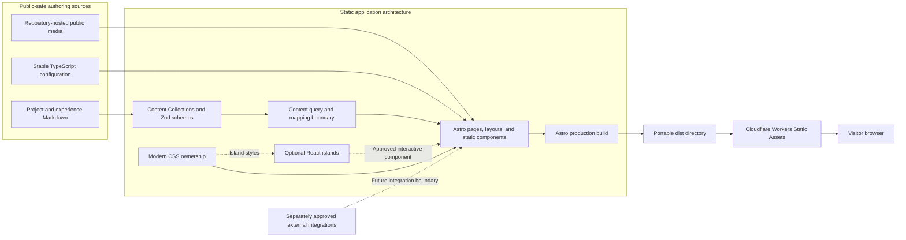

# High-level architecture

## 1. Purpose and scope

This document provides a shared high-level view of how the portfolio is intended to work. It records the boundaries and flows connecting the framework, content system, rendering and hydration model, presentation, verification, generated output, hosting environments, and optional private experimentation infrastructure. It exists so that implementation can proceed from one coherent architectural view rather than reconstructing constraints from several decisions.

The document describes the current intended architecture before application implementation. It is a living architectural view, not an architectural decision record (ADR): it consolidates accepted decisions and may evolve as the implemented system evolves, but it does not replace or amend those decisions. It must remain aligned with all accepted ADRs. If this view and an accepted ADR differ, the ADR is authoritative and the inconsistency must be corrected or resolved through the decision process.

The system boundary covers public-safe authoring in Git, build-time content validation and rendering, selective browser hydration, portable static output, Cloudflare delivery, and visitor access. It also identifies external destinations and future integration seams. Detailed component design, an exact directory tree, visual design, provider implementation, deployment workflow configuration, and other implementation mechanics remain future concerns.

## 2. Architectural principles

- **Static-first rendering.** Resolve public content and ordinary presentation at build time, and generate static routes by default.
- **Progressive enhancement.** Begin with meaningful semantic HTML and normal browser behaviour; add client behaviour or animation only when it improves a concrete experience.
- **Content as canonical structured data.** Keep each editorial fact in one public-safe, validated source and derive previews or alternative presentations from it.
- **Evidence and public safety before publication.** Publish factual, permitted evidence only; confidentiality and accuracy require accountable human review before commit.
- **Minimal browser JavaScript.** Treat every script and hydration directive as an explicit performance, accessibility, and maintenance cost.
- **Local ownership of interactive state.** Let a coherent island own its interactive tree and state; do not introduce application-wide client state by default.
- **Provider isolation at external boundaries.** Keep external SDK types and failure behaviour behind small project-owned boundaries if an integration is approved.
- **Portable generated output.** Keep `dist` standards-based and independently servable by an ordinary static server.
- **Accessibility and performance throughout.** Apply both concerns to content, rendering, styling, motion, interaction, testing, and deployment rather than treating them as final checks.
- **No speculative backend or infrastructure.** Add runtime compute, persistence, bindings, or providers only after an approved requirement demonstrates the need.
- **Measured extension.** Introduce abstractions and additional layers in response to observed repetition, risk, or coupling, not hypothetical scale.

## 3. System context

The **portfolio visitor** uses a browser to consume static production output, follow internal routes, download approved resources, and visit external professional destinations such as GitHub, LinkedIn, a CV, or a contact method. Core content and navigation do not depend on an application server or an external integration.

The **portfolio maintainer** authors code, stable configuration, public-safe Markdown, and repository-hosted media through Git. The **GitHub repository** is the canonical source, history, collaboration surface, and review boundary. Because the repository and enabled preview URLs are public, material must be safe to disclose before it is committed.

**Cloudflare Workers Builds** checks out the relevant Git revision and runs the production build. **Cloudflare Workers Static Assets** distributes the resulting `dist` directory. A custom production domain becomes the canonical visitor entry point when separately introduced and configured; it does not change the static application boundary.

The **optional private Synology NAS** may serve a local build for home-network experiments. It is outside the production system boundary and outside CI, previews, release, routing, availability, rollback, and failover. Future analytics or contact providers are not current systems and are therefore described only as external extension points.

## 4. Logical application modules

These modules describe logical responsibilities within one statically built application. They are not microservices, independently deployed units, or a mandatory directory structure.

| Logical module | Responsibilities and boundaries |
| --- | --- |
| **Public content sources** | Project Markdown entries, experience Markdown entries, long-form project or case-study prose, repository-hosted public media, and public-safe authoring. In the MVP, a case study remains part of its project entry rather than becoming an independent collection. |
| **Stable site configuration** | Small, stable TypeScript definitions such as navigation, site metadata, professional profile URLs, and other non-editorial constants. It must not replace editorial content collections or become a second content system. |
| **Content contract and loading** | `src/content.config.ts`, Astro Content Collection registration, local file loading, project-owned Zod schemas, metadata validation, typed collection entries, and justified cross-field invariants. Invalid structured metadata fails the build. |
| **Content query and mapping boundary** | Collection access; genuinely required visibility filtering; ordering; featured selection; relationship resolution; and mapping entries to deliberate page-facing models. This is a small architectural seam, not a complete repository/use-case/adapter hierarchy for local Markdown. Pages and components should neither scatter raw collection access nor adopt the shapes of a hypothetical CMS SDK. |
| **Route and page composition** | Astro file-based routes, layouts, metadata, semantic document structure, page composition, static route generation, custom not-found output, and rendering canonical content and derived previews. |
| **Static presentation components** | Reusable `.astro` components, semantic HTML, navigation, content presentation, cards, summaries, sections, document structure, and scoped Astro styles. Static presentation must not become React merely for familiarity, styling, or animation. |
| **Interactive islands** | Bounded client behaviour such as a justified responsive control, filter, enhanced form, or comparable interaction. React is the only client UI framework. Hydration requires a concrete user-facing need; each island owns its internal tree and state; and Astro-to-React props remain serialisable. Tightly coupled interactions normally form one coherent island rather than synchronised islands. Shared global state requires a demonstrated cross-island need and architectural reassessment. Essential content and navigation remain meaningful before hydration. |
| **Styling system** | Global reset and base styles; primitive and semantic CSS custom-property tokens; themes when introduced; accessibility helpers; scoped Astro styles; CSS Modules for React island styles; and media, container, and preference queries. Exact token values, breakpoints, typography, palette, and final visual design are not fixed here. |
| **Static assets and generated output** | Approved images and fonts, the CV and other downloadable public resources, `_headers` and `_redirects` when implemented, and generated HTML, CSS, JavaScript, and assets in `dist`. The output remains portable and servable by a standard static server without Cloudflare-specific processing. |

### Quality verification

Quality verification is cross-cutting rather than an application runtime module. Its responsibilities include:

- TypeScript and Astro checks, content-schema validation, linting, and production builds;
- generated route, required asset, HTML, internal-link, and appropriate external-link validation;
- Vitest for meaningful pure logic such as queries, mappings, helpers, and custom invariants;
- React Testing Library for justified island behaviour, using semantic user interaction;
- Playwright journeys against production-build output;
- representative automated accessibility scans with axe; and
- mandatory manual accessibility, visual, responsive, content-accuracy, and confidentiality review.

This view selects no test configuration and implements no CI workflow.

## 5. Content flow

The complete build-time flow is:

1. The maintainer creates or modifies public-safe Markdown, repository-hosted media, or stable TypeScript configuration.
2. Git records the change and provides the review boundary.
3. Astro Content Collections load the local entries.
4. Project-owned Zod schemas validate structured metadata and produce typed entries.
5. Small content-query modules filter, order, select, resolve, and map entries as required.
6. Pages consume deliberate page-facing shapes instead of raw storage or future provider models.
7. Astro renders semantic HTML and statically generates the required routes.
8. Approved React islands render initial HTML and are selectively hydrated for their owned interaction.
9. Astro emits portable output into `dist`.
10. Cloudflare serves that static output to visitors.

Homepage project and experience previews derive from their canonical collection entries. They are not separately maintained copies. The same ownership rule applies whenever a summary or related-content presentation is derived elsewhere.

Confidentiality review occurs before commit because publishing to a public Git repository is already disclosure. A visibility or publication field may control generated output, but it does not make committed material private. Schema validation can establish structure, not truth or permission: content accuracy, professional claims, evidence quality, and permission to publish remain human responsibilities.

## 6. Rendering and hydration model

### Build time

Build time owns content loading and validation, content querying and mapping, static route and metadata generation, Astro layout and component rendering, approved asset processing, initial rendering of any island, and production output generation. Ordinary content routes are complete static documents when the build finishes.

### Browser runtime

Static HTML and CSS form the default experience. Browser JavaScript is shipped only for approved React islands or small progressive-enhancement scripts with a concrete purpose. Each island uses the `client:*` strategy appropriate to its urgency and visibility; this document deliberately does not prescribe one directive globally.

No Worker runtime, server adapter, application server, backend API, or client router participates in ordinary page requests. Native cross-document View Transitions may progressively enhance navigation where justified, with normal browser navigation as the fallback. Astro's client router must not be added solely to animate navigation.

### State ownership

Content and ordinary presentation state are resolved primarily at build time. Interactive state remains local to the island that owns the behaviour. URL state may be appropriate when it improves navigation, sharing, history, or restoration. No application-wide React root, SPA architecture, general global store, or default global client state is part of the initial architecture. The MVP has no persistent server-side state.

## 7. Static and interactive boundary

| Boundary guidance | Examples | Rationale |
| --- | --- | --- |
| **Normally static** | Headings and prose; project and experience content; navigation links; project previews; metadata; contact links; CV access; page layout; visual presentation; ordinary responsive layout | These can be expressed as build-time data, semantic HTML, and CSS without client-owned state. |
| **May justify an island** | An interactive project filter; a collapsible navigation control when native HTML and CSS are insufficient; an enhanced contact form if separately approved; other client-owned state with concrete user value | The behaviour needs a bounded interactive lifecycle and should remain useful, accessible, and understandable around hydration. |
| **Does not justify an island** | Styling; hover effects; static cards; ordinary links; decorative animation; reading Markdown; accessing static content; use of a React library without a product requirement | Familiarity or implementation convenience does not outweigh avoidable JavaScript and hydration cost. |

The examples are decision guidance, not approval or roadmap commitments for any interactive feature. A proposed island still requires a specific need, an appropriate fallback, serialisable inputs, accessible behaviour, and review of its browser cost.

## 8. High-level application diagram

The authoring boundary contains public-safe Markdown, media, and stable configuration. Collections and project-owned schemas load and validate Markdown, after which the query and mapping boundary produces intentional page-facing data. Media and stable configuration enter page composition directly where appropriate without becoming editorial duplicates.

Astro pages, layouts, and static components own the document, routes, metadata, semantic structure, and ordinary presentation. Modern CSS supplies global foundations and component-owned styles. An optional React island is an approved interactive component within Astro's composition rather than a parallel application or build entry point; CSS Modules retain style ownership within that island. The dashed arrows mark optional relationships, not required runtime dependencies.

The single Astro production build combines these inputs and emits `dist`. Cloudflare Workers Static Assets distributes that portable directory, and the visitor browser receives static HTML, CSS, assets, and only the JavaScript required by approved enhancements. Future integrations sit outside the core boundary and may connect through a separately assessed, project-owned integration boundary; the exact build-time, client, or possible future runtime placement depends on the approved requirement. Core content remains available if they are absent or fail.

## 9. Deployment and environment model

### Local

The local context supports authoring, static validation, tests, production builds, and serving `dist` with a standard static server. Normal development requires neither Cloudflare nor the NAS.

### Preview

A non-production branch creates a non-promoted Cloudflare Worker version with a public-safe preview URL for pull-request review. It does not change production and is not permanent archival hosting. Preview must receive neither confidential content nor production credentials without a separately approved and demonstrated requirement. Preview and production configuration may differ safely.

### Production

Only `main` creates production. Its Cloudflare build becomes the active static deployment and uses the canonical custom domain when configured. Production is independent of the NAS and home network, retains deployment history and rollback capability, and requires a post-deployment smoke check when the release workflow is implemented.

### Optional private NAS

The NAS may privately serve a local `dist` build, enable testing on home-network devices, or support Nginx, Apache, Docker, caching, and header experiments. It is not official staging, a promotion gate, a canonical preview, production fallback, failover, public route, CI dependency, or release dependency. Removing it from the workflow must have no effect on releases or production availability.

## 10. Deployment-flow diagram

```mermaid
flowchart TD
    subgraph Canonical["Canonical Git and Cloudflare release path"]
        Branch["Maintainer feature branch"]
        PR["Pull request into main"]
        Checks["Repository quality checks when implemented"]
        PreviewBuild["Cloudflare non-production branch build"]
        Preview["Non-promoted preview version"]
        Review["Public-safe preview review"]
        Merge["Approval and merge into main"]
        ProductionBuild["Cloudflare production build from main"]
        History["Cloudflare deployment history"]
        Active["Active production deployment"]
        Smoke["Post-deployment smoke validation"]

        Branch --> PR
        PR -. Future workflow responsibility .-> Checks
        PR --> PreviewBuild
        PreviewBuild --> Preview
        Preview --> Review
        Review --> Merge
        Checks -. Required gate when introduced .-> Merge
        Merge --> ProductionBuild
        ProductionBuild --> History
        History --> Active
        Active --> Smoke
        History -. Rollback previous version .-> Active
    end

    subgraph Private["Optional private experimentation"]
        LocalBuild["Local Astro build and dist"]
        NAS["Private Synology NAS"]
        LocalBuild -. Optional private copy .-> NAS
    end
```

1. The maintainer works on a feature branch and opens a pull request into `main`.
2. Repository quality checks become a required merge gate when those workflows are implemented; the diagram does not claim that GitHub Actions or any particular runner already exists.
3. Cloudflare builds the non-production branch as a distinct, non-promoted version and exposes a public-safe preview for review.
4. Review considers the preview and available quality evidence. A preview is never promoted directly to production.
5. Approval leads to a Git merge into `main`; this new Git revision, rather than the preview artefact, triggers a separate Cloudflare production build.
6. A successful production build enters Cloudflare's deployment history and its selected version becomes the active deployment. The implemented workflow then performs a smoke validation against production.
7. Cloudflare's deployment history supplies the previous version used for rollback if the new deployment fails. Rollback restores a deployment version; it does not make the NAS part of recovery.
8. Separately, a maintainer may copy a locally generated `dist` to a private NAS. This optional path has no arrow into the canonical release flow.

Failure boundaries are explicit. A branch build or preview failure blocks review or merge but cannot alter active production. A quality-check failure blocks progress once that gate exists. A production build failure must leave the prior active deployment serving traffic. A smoke-check failure triggers investigation and, where needed, rollback to a previous Cloudflare version. NAS failure affects only the private experiment. External services are not in the release path, and no developer workstation normally deploys production manually.

## 11. External integration boundaries

### Contact

Direct professional contact links are sufficient initially. A future form requires an approved need and separate assessment of privacy, validation, spam and abuse, accessibility, security, observability, hosting, and failure behaviour. Provider SDK types and responses must be translated at a small project-owned boundary rather than spread through pages. Submission failure must leave an alternative professional contact path available.

### Analytics

Analytics is absent by default; choosing Cloudflare hosting does not authorise it. Any future analytics requires a separate privacy decision and environment design. Preview activity must not contaminate production data, and core rendering and navigation must remain independent of analytics availability.

### GitHub integration

Public profile and repository references are ordinary external links. A future GitHub API integration is not planned by this architecture and would need to solve a concrete requirement. Non-critical data should prefer build-time retrieval or a documented static representation where appropriate. API failure must not remove core portfolio content, and any integration must explicitly handle tokens, rate limits, caching, stale data, and failure.

### Localisation

Localisation is an extension point, not an MVP implementation. If it becomes real, content ownership, route strategy, translated-entry relationships, fallback behaviour, metadata, and canonical URLs require a dedicated decision. Current implementation should avoid needless assumptions that make future locale routing impossible, but must not add an i18n library, locale directories, translation service, or speculative locale abstraction.

### Future Worker functionality

A Worker endpoint may be considered only for an approved feature. Adding Worker code changes the static runtime boundary and therefore requires separate assessment of runtime compatibility, secrets, abuse, privacy, cost, observability, preview configuration, testing, and rollback. D1, KV, R2, Durable Objects, Queues, databases, and other persistent services remain outside the architecture until separately justified.

## 12. Security and privacy boundaries

- The repository and enabled preview URLs are public; only public-safe content and media may be committed.
- Client-exposed configuration is public. Secrets must never enter content, generated HTML, browser JavaScript, source maps, or static assets.
- Production credentials must not be exposed to previews without an approved, demonstrated requirement and suitable isolation.
- External integrations must fail safely and must not prevent access to core content or alternative contact routes.
- Security headers and redirects belong to project-owned deployment policy where the platform supports them.
- Automated pattern checks may catch known exposures, but cannot prove confidentiality, factual accuracy, or permission to publish.
- Accountable human review remains mandatory before publication.

This document does not define a complete Content Security Policy or final values for any header; those depend on approved implementation details and integrations.

## 13. Architectural invariants

- Ordinary content routes are statically generated.
- `.astro` is the default technology for pages, layouts, and static presentation.
- React requires meaningful client interaction and is used only in bounded islands.
- There is no application-wide React root, SPA, client router, or default global client state.
- Canonical editorial content has one source; previews and summaries are derived.
- Pages do not own raw external-provider or hypothetical CMS models.
- Browser JavaScript is an explicit cost and every hydrated boundary is reviewable.
- Generated `dist` output remains portable and servable by a standard static server.
- Production does not depend on the NAS, home network, or a developer workstation.
- Non-production previews do not alter or promote production; only `main` creates production.
- No backend, database, persistent state, Cloudflare binding, or Worker script exists without a separately approved requirement.
- Accessibility, essential content, and normal navigation do not depend on hydration or animation.
- External integrations cannot become required for core content access.
- Content structure is validated automatically, while accuracy, permission, and confidentiality remain human responsibilities.

## 14. Decision traceability

| Concern | Accepted source | Architectural constraint summarised here |
| --- | --- | --- |
| Framework and rendering | [ADR 0001: Use Astro as the primary frontend framework](decisions/0001-use-astro-as-the-primary-frontend-framework.md) | Static generation, `.astro` by default, React as the only selectively hydrated client UI framework, and no initial server adapter. |
| Styling | [ADR 0002: Use modern CSS as the primary styling strategy](decisions/0002-use-modern-css-as-the-primary-styling-strategy.md) | Native CSS, controlled global foundations, Astro scoped styles, CSS Modules for islands, and semantic custom-property tokens. |
| Animation | [ADR 0003: Use a native-first, purpose-driven animation strategy](decisions/0003-use-a-native-first-purpose-driven-animation-strategy.md) | Native progressive enhancement, designed reduced-motion behaviour, and normal navigation independent of animation. |
| Content management | [ADR 0004: Use Git-versioned Astro Content Collections](decisions/0004-use-git-versioned-astro-content-collections.md) | Public Markdown in Git, project-owned schemas, typed collections, deliberate query boundaries, and pre-commit confidentiality review. |
| Hosting and deployment | [ADR 0005: Use Cloudflare Workers Static Assets for hosting](decisions/0005-use-cloudflare-workers-static-assets-for-hosting.md) | Portable `dist`, static Cloudflare delivery, branch previews, `main`-only production, rollback, no initial Worker script, and NAS isolation. |
| Testing | [ADR 0006: Use a pragmatic risk-based testing strategy](decisions/0006-use-a-pragmatic-risk-based-testing-strategy.md) | Static and build checks, focused Vitest and React tests, Playwright and axe coverage, and mandatory human validation. |
| Product structure and outcomes | [Product vision](../product/product-vision.md), [information architecture](../product/information-architecture.md), [content strategy](../product/content-strategy.md), and [product success criteria](../product/product-success-criteria.md) | Evidence-led public content, canonical ownership, MVP routes and case-study structure, confidentiality, accessibility, performance, maintainability, and production-readiness outcomes. |

This table traces constraints only. The investigations, alternatives, and option matrices remain in their source documents and are not duplicated here.

## 15. Non-goals

This document does not:

- implement application code;
- define the final directory tree;
- create a design system;
- fix visual design or token values;
- select analytics or a contact-form provider;
- implement localisation;
- introduce a backend, CMS, database, Worker script, or binding;
- create CI workflows or detailed test cases;
- configure Cloudflare;
- buy or configure a domain;
- add infrastructure as code;
- create an ADR convention, template, or index; or
- update the README.

## 16. Evolution and review triggers

Review and, where appropriate, update this architectural view when:

- React islands become numerous or tightly coupled;
- shared client state becomes a demonstrated requirement;
- dynamic rendering becomes necessary;
- authentication or personalisation is introduced;
- a contact form or other API is approved;
- a CMS or non-technical editorial workflow is required;
- localisation becomes active;
- GitHub data becomes dynamic application content;
- analytics is approved;
- persistent data is required;
- Cloudflare Worker code or bindings are introduced;
- the accepted hosting or testing decisions are superseded;
- the NAS gains a new private role that remains separate from production; or
- product routes or content ownership change materially.

These conditions trigger architectural review. They do not pre-authorise a technology, integration, runtime, provider, or change to the current boundaries.
