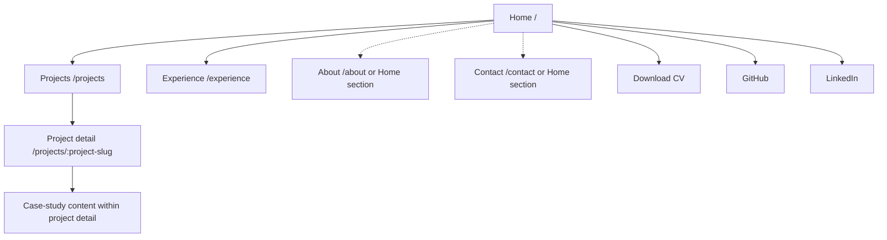

# Information architecture

## 1. Purpose

This information architecture translates the [product vision](product-vision.md) into an understandable content and navigation structure. It is intended to:

- Communicate my professional positioning quickly.
- Support different levels of technical depth through progressive disclosure.
- Prioritise evidence over unsupported claims.
- Remain understandable for technical and non-technical visitors.
- Support a focused MVP.
- Allow future extension without premature complexity.

This document defines how content is organised and how destinations relate to one another. It does not define visual design, components, or navigation implementation.

## 2. Information architecture principles

### Progressive disclosure

Visitors should encounter concise professional information first, then choose whether to access deeper technical detail. Recruiters can understand my relevance without reading a case study, while technical visitors can follow projects into decisions, trade-offs, and engineering evidence.

### Evidence close to claims

Professional claims should link naturally to the projects, experience, case studies, repository material, or technical documentation that supports them. Evidence should be easy to reach from the context in which a claim appears.

### Clear content ownership

Each content type should have one canonical location. Other pages may provide short previews and links, but should not reproduce the complete content. This keeps information consistent and maintainable.

### Focused navigation

The main navigation should contain only destinations that support the primary visitor actions: understanding professional experience, reviewing evidence, and making contact. Resources and external profiles remain prominent actions without competing with internal destinations.

### Mobile-first simplicity

The hierarchy and navigation must remain understandable on narrow screens. The MVP should not depend on complex nested menus or desktop-only navigation patterns.

### Extensibility without premature abstraction

The structure should allow future articles, localisation, and additional case studies when justified. Empty sections, speculative content types, and unnecessary top-level destinations should not be included in the MVP.

## 3. Initial sitemap



The home page is the entry point to the portfolio's main internal destinations. Projects provide the path from a curated overview to detailed technical evidence. In the MVP, case studies are an in-depth presentation mode within project detail pages rather than a separate content hierarchy or top-level route.

Home, Projects, Project detail, and Experience are the initial routes required by this architecture. About and Contact are required content destinations, but may begin as home-page sections. Their dotted connections in the diagram indicate that dedicated routes are conditional on having enough distinct, credible content.

The CV, GitHub, and LinkedIn are direct actions or external resources, not primary internal pages. The exact route syntax may change during implementation, but the content hierarchy should remain equivalent.

## 4. Page inventory

### Home — `/`

**Purpose:** Communicate my professional positioning within a few seconds, introduce the strongest evidence, and direct visitors towards projects, experience, the CV, professional profiles, and contact.

**Primary audience:** All visitors, particularly recruiters, hiring managers, and first-time visitors.

**Expected content:** Professional positioning, a concise summary, selected project and experience previews, evidence-supported engineering strengths, an overview of engineering process, primary actions, and a contact call to action. Home is a curated overview and should not reproduce every detail from other pages.

### Projects — `/projects`

**Purpose:** Present selected projects that can be shown publicly without exposing confidential information, help visitors compare them by problem, role, technologies, and engineering relevance, and provide access to detailed project or case-study content.

**Primary audience:** Engineering managers, technical evaluators, software engineers, and recruiters seeking concrete evidence.

**Expected content:** A curated project collection with concise context, my role, relevant technologies, professional relevance, and links to credible detail pages. It is not an exhaustive archive.

### Project detail — `/projects/:project-slug`

**Purpose:** Explain one selected project in depth and provide technical evidence without exposing confidential information. This is the canonical location for a project's case study in the MVP.

**Primary audience:** Engineering managers, technical leads, software engineers, and interested recruiters.

**Expected content:** Context, problem, constraints, responsibilities, decisions, trade-offs, implementation approach, quality practices, and outcomes. Depth may vary by project, and only factual, public-safe evidence should be included.

### Experience — `/experience`

**Purpose:** Explain my professional trajectory, relevant responsibilities, and the development of my frontend specialisation and wider software experience.

**Primary audience:** Recruiters, hiring managers, and technical evaluators.

**Expected content:** Selected roles or stages of experience, responsibilities, safe descriptions of challenges and contributions, capabilities developed, and links to related public-safe evidence where appropriate. Experience may follow a chronological structure, but each entry should prioritise relevant responsibilities, contributions, and professional growth rather than reproduce the CV verbatim. Confidential employer details, private metrics, internal project names, and proprietary information remain excluded.

### About — `/about` or Home section

**Purpose:** Provide concise personal and professional context, explain engineering values, working approach, interests, and professional direction, and humanise the profile without unrelated lifestyle content.

**Primary audience:** Visitors evaluating professional fit, collaboration style, and motivation.

**Expected content:** Engineering values, approach to product and collaboration, relevant interests, and professional direction. It should not duplicate the full professional experience section.

About may initially be integrated into the home page if there is not enough distinct content to justify a dedicated route.

### Contact — `/contact` or Home section

**Purpose:** Make professional contact straightforward and provide appropriate contact channels.

**Primary audience:** Recruiters, hiring managers, potential collaborators, and professional contacts.

**Expected content:** Direct contact options and, where useful, links to LinkedIn, GitHub, and the CV. Contact may initially be implemented as a dedicated home-page section. A separate `/contact` route should be introduced only when the amount or nature of the contact content justifies it. The initial implementation may use direct contact links. A form should be introduced only when its privacy, validation, spam protection, accessibility, and infrastructure implications have been addressed.

## 5. Home-page sections

The home page should contain the following sections in this order.

### 1. Hero and professional positioning

Communicate my name, current professional role, React and TypeScript specialisation, a concise value proposition, and primary actions such as viewing projects or making contact. Final marketing copy and visual layout are outside this document's scope.

### 2. Professional summary

Provide a short explanation of frontend specialisation, experience with production systems, engineering values, and wider full-stack experience where relevant. Keep this concise and link to Experience or About for more detail.

### 3. Selected projects

Show a small, curated set of the strongest projects. Each preview should communicate the problem or purpose, my role, why the project is professionally relevant, and a path to its detail page. The exact number of items and their visual presentation are not defined here.

### 4. Engineering strengths

Present key areas supported by evidence, including React and TypeScript, component architecture, strict typing, accessibility, automated testing, maintainability and extensibility, and product and domain reasoning. Link to supporting projects, experience, or documentation where possible.

### 5. Selected experience

Provide a concise preview of professional experience and responsibilities. Detailed, canonical experience content belongs on `/experience`.

### 6. Engineering process

Explain how the portfolio itself demonstrates engineering practice through documentation, architectural decisions, issues and milestones, pull requests, automated tests, and continuous integration and quality gates as they are introduced. Link to the repository or relevant documentation.

### 7. Contact call to action

Provide a clear path for professional contact and access to relevant external profiles.

### 8. Footer

Include essential navigation, external professional links, and any legally required links. Do not add legal links before actual data collection, analytics, forms, or applicable requirements make them necessary.

## 6. Main navigation

The primary navigation should expose these content destinations:

- Home
- Projects
- Experience
- About
- Contact

About and Contact may link to sections on Home until dedicated routes are justified. This changes their initial form, not their position in the content hierarchy or their availability to visitors.

Download CV, GitHub, and LinkedIn should appear as prominent actions or secondary navigation items rather than equal top-level destinations.

The navigation should follow these rules:

- Keep the main navigation shallow.
- Do not use nested desktop menus in the MVP.
- Do not expose future or empty sections.
- Preserve the same destination hierarchy across desktop and mobile.
- Make the current location identifiable in the eventual implementation.
- Consider keyboard and assistive-technology accessibility during implementation.

Exact components, breakpoints, animations, and menu interaction patterns are outside this document's scope.

## 7. Mobile navigation considerations

Mobile navigation must:

- Preserve access to every main destination.
- Avoid multi-level navigation.
- Keep primary actions understandable without relying only on icons.
- Support keyboard navigation when relevant.
- Give any collapsible menu control an accessible name and exposed state.
- Maintain a logical focus order.
- Avoid hiding critical contact or project access behind unclear interactions.
- Keep external profile links and CV access available without overcrowding the primary hierarchy.

Detailed interaction design belongs to future design and implementation tasks.

## 8. Content relationships

### Experience

Experience represents the professional timeline, responsibilities, capabilities, and growth. It answers:

- Where have I applied my skills?
- What responsibilities have I held?
- How has my professional scope developed?

### Projects

Projects represent concrete products or technical initiatives selected because they demonstrate relevant capabilities. They answer:

- What did I build or contribute to?
- What problem did the project address?
- Why is it relevant to my professional positioning?

### Case studies

Case studies represent the detailed narrative and reasoning associated with selected projects. They answer:

- What constraints existed?
- Which decisions were made?
- Which alternatives or trade-offs were considered?
- How were accessibility, testing, architecture, and maintainability addressed?
- What was learned or achieved?

For the MVP:

- A case study is a detailed mode of presenting a project.
- Case studies live within project detail pages.
- Not every project needs a full case study.
- Experience entries may link to public-safe related projects or case studies.
- Projects may reference relevant experience without duplicating the full experience content.
- Confidential professional work may be described through anonymised challenges and contributions, but should not be represented as a public project when doing so would expose protected information.

## 9. Canonical content and duplication rules

Content ownership is defined as follows:

- **Professional positioning:** Canonical concise version on Home.
- **Detailed professional history:** Experience.
- **Engineering values and personal context:** About, whether presented on Home or on a dedicated page.
- **Project summaries:** Projects index.
- **Detailed project evidence:** Project detail.
- **Contact channels:** Contact, whether presented on Home or on a dedicated page.
- **CV:** External or downloadable resource.
- **Repository process and technical documentation:** Repository and linked documentation.

Other pages may contain short previews, but should link to the canonical location instead of duplicating entire sections.

## 10. Key visitor journeys

### Recruiter journey

```text
Home
→ Understand role and specialisation
→ Review selected projects or experience
→ Open CV or LinkedIn
→ Contact
```

The recruiter should be able to identify my role and professional relevance without reading technical detail.

### Engineering manager journey

```text
Home
→ Review engineering strengths
→ Open selected project
→ Read decisions, trade-offs, testing, and architecture
→ Review experience
→ Contact
```

This journey should demonstrate engineering judgment and ownership.

### Software engineer journey

```text
Home
→ Open project detail
→ Explore technical reasoning
→ Visit repository or technical documentation
→ Review architectural decisions and development practices
```

### Direct project visitor journey

```text
Project detail
→ Understand project context
→ Explore technical evidence
→ Discover related projects or experience
→ Contact or visit professional profiles
```

### Mobile visitor journey

```text
Home
→ Identify role
→ Open simple navigation
→ Reach projects, experience, or contact
→ Return without losing context
```

## 11. MVP scope

The MVP requires these routes:

- Home.
- Projects index.
- Project detail pages.
- Experience.

It also requires these destinations and resources:

- About content, initially on Home or on a dedicated page when justified.
- Contact content, initially on Home or on a dedicated page when justified.
- CV access.
- GitHub and LinkedIn access.
- Basic footer navigation.
- Repository and technical-documentation references where relevant.

The MVP may initially launch with a limited number of carefully selected projects. A route should exist only when it has credible content; empty project detail pages and placeholder sections should not be created solely to satisfy the sitemap.

## 12. Future extensions

The architecture should conceptually support, but the MVP excludes:

- Technical articles or a blog.
- Dedicated article detail pages.
- Localisation or multiple languages.
- Search.
- Content filtering or tagging.
- Dedicated uses, writing, or tools pages.
- Testimonials.
- Speaking, events, or publications.
- A newsletter.
- CMS integration.
- Advanced analytics dashboards.
- A dedicated case-study index.
- Private or password-protected case studies.
- Multiple contact methods or scheduling integrations.
- Rich project filtering.
- RSS or content syndication.

These additions should be introduced only when real content or product needs justify them. A future structure may extend to:

```text
/articles
/articles/:article-slug
/case-studies
/es/...
```

These routes must not be created in the MVP.

## 13. Extensibility rules

- Use content types that can grow without changing the top-level navigation unnecessarily.
- Allow project details to support different levels of depth.
- Require a distinct visitor need and sufficient content before adding a top-level navigation item.
- Introduce articles and localisation as separate capabilities only when justified.
- Keep navigation stable as project volume grows.
- Introduce filtering only when the number of projects makes browsing difficult.
- Represent content relationships through metadata or links during implementation instead of manually duplicating content across pages.
- Use stable, human-readable route and content identifiers when implemented.

These rules do not prescribe a CMS, framework, routing library, schema implementation, or storage format.

## 14. Accessibility and usability considerations

- Navigation must be understandable without visual styling alone.
- Page titles and headings must communicate hierarchy.
- Link purpose must be clear from context.
- Users must be able to locate the current page.
- Navigation order should be predictable.
- Important content should not depend on hover.
- Mobile and desktop navigation should expose equivalent destinations.
- Skip navigation and landmark structure should be considered during implementation.
- External links and downloadable resources should be communicated clearly.

These are information-architecture requirements. HTML, React, and other implementation details belong to later work.

## 15. Decision boundaries

This document does not decide:

- Visual layout.
- Wireframes.
- Typography.
- Colours.
- Component design.
- Responsive breakpoints.
- Animations.
- Exact menu interactions.
- Framework routing implementation.
- CMS or content storage.
- Final copywriting.
- Analytics implementation.

These decisions belong to later design, architecture, and implementation tasks and must remain aligned with the product vision.
